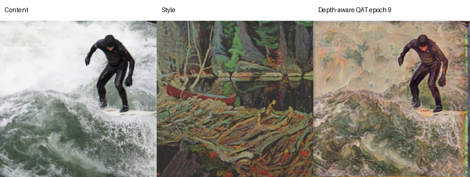
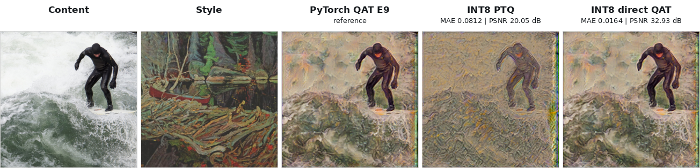
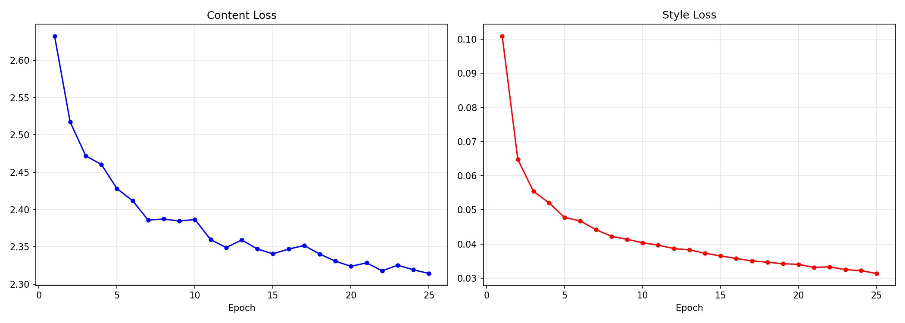
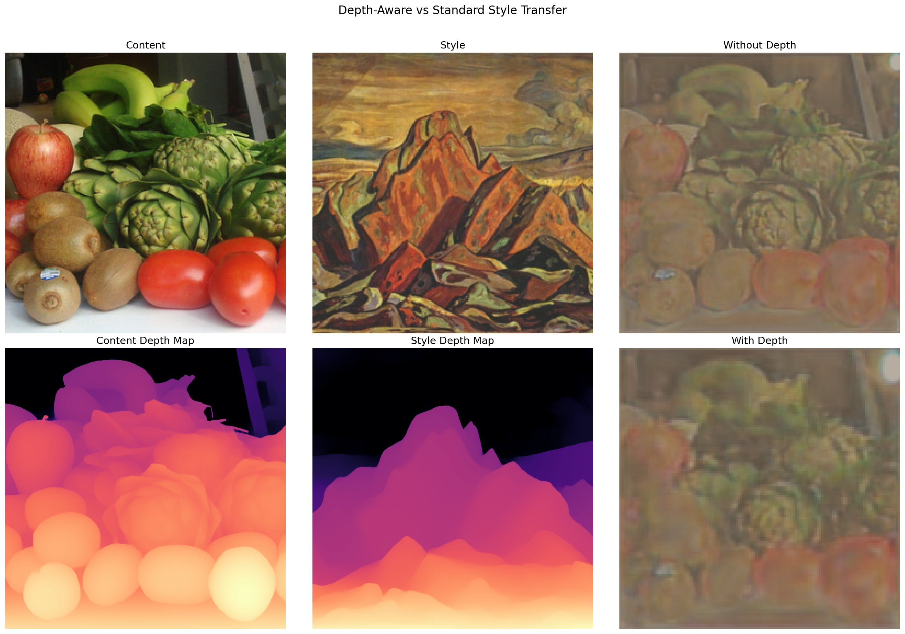

# Depth-Aware Style Transfer with ResNet34 + AdaIN

[](https://www.python.org/downloads/)
[](https://pytorch.org/)
[](LICENSE)

> Replacing VGG19 with ResNet34 for arbitrary style transfer, enhanced with Depth Anything V2 monocular depth estimation for improved spatial coherence, parts of this codebase was used for my EE5561 project under Prof.Mehmet Akcakaya.

<p align="center">
  
</p>

## Key Ideas

**1. ResNet34 replaces VGG19 as the encoder.** Residual connections enable richer multi-level feature extraction across 5 hierarchical levels (64 to 512 channels). The encoder is trained from scratch — we found this outperforms fine-tuning pretrained ResNet, reducing content loss by 49% over the original VGG19 architecture.

**2. Depth-aware style transfer.** [Depth Anything V2](https://arxiv.org/abs/2406.09414) generates pseudo-depth maps that are concatenated as a 4th input channel (RGB+D), allowing the encoder to learn depth-aware features that preserve 3D spatial structure during stylization.

**3. Multi-level AdaIN.** Adaptive Instance Normalization is applied at all 5 encoder feature levels simultaneously, providing both fine-grained texture transfer and high-level style alignment.

## Architecture

```
Content Image ──────────────────┐
                                ▼
Depth Anything V2 ──► [RGB|Depth] ──► ResNet34 Encoder ──► AdaIN ──► U-Net Decoder ──► Stylized Output
                                                            ▲
Style Image ──────────────────────► ResNet34 Encoder ───────┘
```

- **Encoder:** ResNet34 extracting 5 feature levels (64 → 64 → 128 → 256 → 512 channels)
- **AdaIN:** Aligns content feature statistics to style statistics at each level
- **Decoder:** U-Net style with skip connections and InstanceNorm
- **Depth:** Optional Depth Anything V2 integration via 4-channel input (RGB+D)

## Results

### Training

| Configuration | Dataset | Epochs | Content Loss | Style Loss | Training Time |
|:---|:---|:---:|:---:|:---:|:---:|
| Single Style (Art Nouveau Modern) | 118K COCO + 4.3K WikiArt | 25 | **2.31** | **0.031** | ~57 min (A100) |
| Multi-Style (Full WikiArt) | 118K COCO + 80K WikiArt | 14 | 3.43 | 0.047 | ~6 hrs (A100) |

### Evaluation Metrics (50 content-style pairs)

| Metric | Value |
|:---|:---:|
| SSIM (content preservation) | 0.520 ± 0.094 |
| LPIPS (perceptual quality) | 0.409 ± 0.076 |
| Content Distance | 4.517 ± 2.734 |
| Style Distance | 1.407 ± 1.202 |

### Model and Inference

| | |
|:---|:---|
| Total Parameters | 24.1M (21.3M encoder + 2.8M decoder) |
| TorchScript Export | 96.7 MB |
| 256×256 Inference | 12.8 ms / 78 FPS (A100) |
| 512×512 Inference | 16.4 ms / 61 FPS (A100) |
| 768×768 Inference | 32.7 ms / 31 FPS (A100) |

<!-- ### Quantization Results

The latest quantization comparison uses the MSI depth-aware Art Nouveau model at
epoch 9 (`msi_weights/resnet_adain_depth_qat/checkpoint_epoch_9.pt`) after QAT
fine-tuning. The focused grid below shows the RGB inputs, the PyTorch QAT
reference, and the two INT8 TensorRT outputs.

<p align="center">
  
</p>

Measured image differences:

| Output | MAE vs PyTorch QAT | PSNR vs PyTorch QAT |
|:---|---:|---:|
| TRT FP16 stripped graph | 0.0772 | 20.40 dB |
| TRT INT8 PTQ | 0.0812 | 20.05 dB |
| TRT INT8 direct QAT | 0.0164 | 32.93 dB |

The short version: FP16 is the easy speed/size win. PTQ is a useful baseline,
but QAT is the better INT8 route here because this style-transfer model is very
sensitive to quantization ranges. -->

### Training Loss Curves

<p align="center">
  
</p>

### Depth-Aware vs Standard Style Transfer

<p align="center">
  
</p>

## Quick Start

### Installation

```bash
git clone https://github.com/Yuuki11/depth-aware-style-transfer.git
cd depth-aware-style-transfer

# Recommended: reproducible conda environment
conda env create -f environment.yml
conda activate depth-style

# Existing envs need CUDA compiler/dev packages for ModelOpt CUDA extensions.
conda install -n depth-style -c nvidia cuda-nvcc=12.8 cuda-cudart-dev=12.8 cuda-cccl=12.8

# Alternative: install into an existing environment
pip install -r requirements.txt
```

### Checkpoints

Checkpoints are not committed to the repository. For access to trained weights,
email k.s.rakshithaa@gmail.com.

### Download Data

```bash
# COCO 2017 train images (118K images, ~18GB)
wget http://images.cocodataset.org/zips/train2017.zip
mkdir -p data/coco && unzip train2017.zip -d data/coco/

# WikiArt from Kaggle (80K images, ~31GB)
kaggle datasets download steubk/wikiart
mkdir -p data/wikiart && unzip wikiart.zip -d data/wikiart/
```

### Train

```bash
# Single style — Art Nouveau Modern (~1hr on A100)
python train.py \
    --content_dir data/coco/train2017 \
    --style_dir data/wikiart/Art_Nouveau_Modern \
    --epochs 25 --batch_size 32 \
    --content_weight 1.2 --style_weight 25.0 \
    --amp

# Multi-style — full WikiArt (~6hrs on A100)
python train.py \
    --content_dir data/coco/train2017 \
    --style_dir data/wikiart \
    --epochs 14 --batch_size 8 \
    --content_weight 1.2 --style_weight 25.0

# Depth-aware training
python train.py --use_depth --depth_scale 2.0 --amp
```

### Inference

```bash
python inference.py \
    --content assets/sample_content/000000021447.jpg \
    --style assets/sample_style/a.y.-jackson_hills-at-great-bear-lake-1953.jpg \
    --checkpoint checkpoints/model_final.pt \
    --output output.png

# With depth awareness
python inference.py \
    --content assets/sample_content/000000021447.jpg \
    --style assets/sample_style/a.y.-jackson_hills-at-great-bear-lake-1953.jpg \
    --checkpoint checkpoints/model_final.pt \
    --use_depth --depth_scale 0.1
```

### Gradio Demo

```bash
python app.py --checkpoint checkpoints/model_final.pt --share
```

### Evaluate

```bash
python evaluate.py \
    --content_dir assets/sample_content \
    --style_dir assets/sample_style \
    --checkpoint checkpoints/model_final.pt
```

### Export to TorchScript

```bash
python scripts/export_model.py --checkpoint checkpoints/model_final.pt
```

### Quantization and TensorRT

Quantization is implemented in three layers:

- `train.py --qat` enables QAT during training.
- `scripts/quantize_model.py` exports PTQ or direct-QAT explicit Q/DQ ONNX.
- `scripts/build_tensorrt_engine.py` builds FP32, FP16, and INT8 TensorRT engines
  with the TensorRT Python API.

The default training path is unchanged. If `--qat` is not passed, the model trains
as before.

#### Environment Notes

ModelOpt builds small CUDA extensions the first time the QAT/PTQ code path is
used. If an existing environment reports that `CUDA_HOME` is unset, point it at
the conda environment before running training or export:

```bash
export CUDA_HOME="$CONDA_PREFIX"
export CUDA_PATH="$CONDA_PREFIX"
export CPATH="$CONDA_PREFIX/targets/x86_64-linux/include:${CPATH:-}"
export LIBRARY_PATH="$CONDA_PREFIX/targets/x86_64-linux/lib:${LIBRARY_PATH:-}"
export TORCH_EXTENSIONS_DIR="${TMPDIR:-/tmp}/depth-style-torch-extensions"
```

The CUDA compiler/dev packages are already listed in `environment.yml`, and the
pip dependencies include ModelOpt, ONNX Runtime GPU, TensorRT, and Polygraphy.

#### QAT During Training

QAT happens in the training script. The implementation uses NVIDIA ModelOpt fake
quantizers:

1. Load the normal model.
2. If resuming from an FP32 checkpoint, load those weights first.
3. Insert ModelOpt fake quantizers with `prepare_modelopt_qat`.
4. Run a short calibration forward loop so the quantizers start with reasonable
   activation ranges.
5. Continue training with quantization noise in the forward pass.
6. Save QAT metadata into the checkpoint so export can rebuild the same quantized
   module structure.

This is the command shape for depth-aware QAT fine-tuning from an FP32
depth-aware checkpoint:

```bash
python train.py \
    --use_depth \
    --content_dir data/coco/train2017 \
    --style_dir data/wikiart/Art_Nouveau_Modern \
    --checkpoint_dir checkpoints/depth_qat \
    --sample_dir samples/depth_qat \
    --epochs 25 \
    --batch_size 8 \
    --num_workers 4 \
    --image_size 256 \
    --depth_scale 2.0 \
    --amp \
    --log_interval 50 \
    --resume_from path/to/fp32_depth_checkpoint.pt \
    --qat
```

Useful QAT flags:

| Flag | Default | Notes |
|:---|:---:|:---|
| `--qat` | off | Enables ModelOpt fake-quant training. |
| `--qat_mode` | `int8` | `int8` is the practical path for this Conv/AdaIN model. `int4` is experimental. |
| `--qat_calib_batches` | `32` | Batches used to initialize fake-quant ranges before fine-tuning. |
| `--qat_lr_scale` | `0.1` | Lowers the LR when starting QAT from an FP32 checkpoint. |
| `--qat_disable_final_layer` | on | Keeps the final RGB output conv in higher precision by default. |
| `--qat_quantize_final_layer` | off | Opts into quantizing the final RGB output conv. |

Depth-aware QAT is supported. During training, the PyTorch model still computes
depth maps through `DepthEstimator`. For TensorRT export, Depth Anything is kept
outside the engine and the engine receives explicit `content_depth` and
`style_depth` tensors. That keeps the exported graph TensorRT-friendly.

#### PTQ vs QAT

PTQ is post-training quantization. It takes a trained FP32 model, runs calibration
images through it, then chooses quantization scales after the model is already
done learning. It is fast and it gives a good baseline. In the epoch 9
depth-aware comparison above, PTQ produced a valid INT8 TensorRT output, but it
drifted farther from the PyTorch QAT reference than direct QAT did:

<p align="center">
  
</p>

| Epoch 9 output | MAE vs PyTorch QAT | PSNR vs PyTorch QAT |
|:---|---:|---:|
| TRT INT8 PTQ | 0.0812 | 20.05 dB |
| TRT INT8 direct QAT | 0.0164 | 32.93 dB |

That difference is not just a metric artifact. PTQ calibrates ranges after the
network has already learned a floating-point solution. If a decoder layer, AdaIN
feature map, or depth-conditioned encoder activation has a long-tailed range,
PTQ has to pick a single compromise scale. Values outside that scale get clipped;
values inside it get rounded to INT8 buckets. The weights never get a chance to
adapt to those errors.

QAT changes the training problem. ModelOpt inserts fake quantizers into the
PyTorch model, calibration initializes their ranges, and fine-tuning continues
with quantization noise present in the forward pass. The backward pass still uses
floating-point gradients, but the model is repeatedly exposed to the same kind of
rounding and clipping it will see in an INT8 TensorRT Q/DQ graph. Over a few
epochs, the decoder can learn weights that are less brittle under those ranges.

This matters more for style transfer than it would for many classification
models. A classifier can often tolerate small internal activation changes as long
as the final class ranking is stable. Here, the output is the image itself. Small
activation shifts can change brush texture, local contrast, color balance, and
the boundary between stylized foreground and background. A numerically small
error can be visually obvious.

AdaIN makes the model especially sensitive. It transfers style by matching
feature means and variances between the content and style streams. Quantization
changes those feature statistics. If PTQ picks ranges that slightly compress or
clip a feature channel, the mean/variance estimate changes, and that can move the
stylization result even when the graph still runs successfully. QAT lets the
network train with those quantized statistics in the loop.

Depth awareness adds another reason to prefer QAT. The depth input affects where
style should be preserved or suppressed. If quantization changes the relative
strength of depth-conditioned features, foreground/background treatment can drift.
For this project, the direct-QAT INT8 output kept the surfer and wave structure
much closer to the PyTorch QAT reference, while the PTQ and stripped FP16 graphs
collapsed toward a flatter, more uniformly textured result.

The deployment path follows from that observation:

- Use FP16 when the goal is the safest TensorRT acceleration with minimal visual
  change.
- Use PTQ when a checkpoint was not trained with QAT, or when a quick INT8
  baseline is needed.
- Use direct QAT export for the INT8 model we actually want to ship, because it
  preserves the quantizer placement and learned ranges from training instead of
  recalibrating a plain floating-point graph after the fact.

#### Export Floating-Point ONNX

```bash
python scripts/export_model.py \
    --checkpoint path/to/fp32_depth_checkpoint.pt \
    --format onnx \
    --output_dir exports/depth_fp32 \
    --image_size 256 \
    --use_depth \
    --depth_scale 2.0 \
    --static_onnx_shapes
```

Depth-aware exports create an explicit-depth graph with four inputs:

- `content`
- `content_depth`
- `style`
- `style_depth`

#### PTQ Export

```bash
python scripts/quantize_model.py \
    --checkpoint path/to/fp32_depth_checkpoint.pt \
    --mode ptq \
    --quantize_mode int8 \
    --content_dir data/coco/train2017 \
    --style_dir data/wikiart/Art_Nouveau_Modern \
    --output exports/depth_int8_ptq/style_transfer_int8_qdq.onnx \
    --keep_fp32_onnx exports/depth_int8_ptq/style_transfer_ptq_source.onnx \
    --image_size 256 \
    --use_depth \
    --depth_scale 2.0 \
    --static_onnx_shapes \
    --calib_batches 64
```

#### Direct QAT Export

For QAT checkpoints, use direct export:

```bash
python scripts/quantize_model.py \
    --checkpoint path/to/checkpoint_epoch_9.pt \
    --mode qat_direct_export \
    --output exports/epoch9_qat/style_transfer_qat_direct_qdq.onnx \
    --image_size 256 \
    --use_depth \
    --depth_scale 2.0 \
    --static_onnx_shapes \
    --no_external_data
```

This path preserves ModelOpt fake-quantizer placement and exports an explicit
Q/DQ ONNX graph. In the current epoch 9 run the ONNX graph has 170
`QuantizeLinear` nodes and 170 `DequantizeLinear` nodes.

There is also a legacy `--mode qat_export`. It strips ModelOpt quantizer modules,
exports the learned weights as a plain FP32 graph, then runs ONNX PTQ calibration.
That can be useful for debugging, but it is not the preferred deployment path for
QAT because it no longer matches the fake-quantized PyTorch graph.

#### Build TensorRT Engines

The builder defaults to a 7.5 GB workspace and TensorRT builder optimization
level 5. You can override either with `--workspace_gb` and
`--builder_optimization_level`.

```bash
# FP32 engine
python scripts/build_tensorrt_engine.py \
    --onnx exports/depth_fp32/style_transfer.onnx \
    --engine exports/depth_fp32/style_transfer_fp32.engine \
    --precision fp32 \
    --input_names content,content_depth,style,style_depth \
    --min_shape 1x3x256x256 \
    --opt_shape 1x3x256x256 \
    --max_shape 1x3x256x256

# FP16 engine
python scripts/build_tensorrt_engine.py \
    --onnx exports/depth_fp32/style_transfer.onnx \
    --engine exports/depth_fp32/style_transfer_fp16.engine \
    --precision fp16 \
    --input_names content,content_depth,style,style_depth \
    --min_shape 1x3x256x256 \
    --opt_shape 1x3x256x256 \
    --max_shape 1x3x256x256

# INT8 PTQ engine
python scripts/build_tensorrt_engine.py \
    --onnx exports/depth_int8_ptq/style_transfer_int8_qdq.onnx \
    --engine exports/depth_int8_ptq/style_transfer_int8.engine \
    --precision int8 \
    --input_names content,content_depth,style,style_depth \
    --min_shape 1x3x256x256 \
    --opt_shape 1x3x256x256 \
    --max_shape 1x3x256x256

# INT8 direct-QAT engine
python scripts/build_tensorrt_engine.py \
    --onnx exports/epoch9_qat/style_transfer_qat_direct_qdq.onnx \
    --engine exports/epoch9_qat/style_transfer_qat_direct_int8.engine \
    --precision int8 \
    --input_names content,content_depth,style,style_depth \
    --min_shape 1x3x256x256 \
    --opt_shape 1x3x256x256 \
    --max_shape 1x3x256x256
```

#### Run TensorRT Inference

```bash
python scripts/run_tensorrt_inference.py \
    --engine exports/epoch9_qat/style_transfer_qat_direct_int8.engine \
    --content assets/sample_content/000000021447.jpg \
    --style assets/sample_style/a.y.-jackson_hills-at-great-bear-lake-1953.jpg \
    --output outputs/epoch9_trt_int8_qat_direct.png \
    --image_size 256 \
    --use_depth \
    --save_grid
```

#### Compare QAT Checkpoints

```bash
python scripts/compare_pytorch_checkpoints.py \
    --checkpoint_dir path/to/qat_checkpoints \
    --pattern 'checkpoint_epoch_*.pt' \
    --content samples/resnet_adain_depth_qat/epoch010_sample0_content.png \
    --style samples/resnet_adain_depth_qat/epoch010_sample0_style.png \
    --output_dir outputs/qat_epoch_compare \
    --image_size 256 \
    --use_depth \
    --depth_scale 2.0 \
    --columns 4
```

INT8 is the recommended low-bit path for this Conv/AdaIN model. INT4 and FP8 are
exposed in the tooling for experiments, but INT4 mainly helps MatMul/Gemm-heavy
graphs and FP8 depends on newer TensorRT/GPU support. INT16 is not a normal
TensorRT inference target here; use FP16 if the goal is a 16-bit engine.

## Hyperparameter Guide

| Parameter | Default | Notes |
|:---|:---:|:---|
| `content_weight` | 1.2 | Higher = more content preservation |
| `style_weight` | 25.0 | ResNet needs higher style weight than VGG (which uses 10.0) |
| `lr_decoder` | 1e-3 | Decoder needs higher LR than encoder |
| `lr_encoder_high` | 1e-4 | For layer3, layer4 |
| `lr_encoder_low` | 1e-5 | For conv1, layer1, layer2 |
| `depth_scale` | 2.0 | Scale factor for depth channel input |
| `alpha` | 1.0 | Style strength at inference (0 = content only, 1 = full style) |

## Key Findings
- **ResNet needs higher style weights.** Default AdaIN weights (1.0/10.0) barely
  transfer style with ResNet. We found 1.2/25.0 works well.
- **Training from scratch outperforms pretrained.** Pretrained ResNet produced noisy,
  color-shifted outputs. Training from scratch converged faster with 49% lower
  content loss (4.55 → 2.31).
- **Abstract styles transfer better.** The model handles painterly styles well but
  tends to transfer color over fine textures — a known limitation of ResNet's
  low-entropy feature maps.
- **Depth preserves spatial coherence at the cost of style intensity.** The depth map
  suppresses style transfer on foreground objects to preserve 3D structure, so
  depth-aware outputs appear less stylized but retain sharper edges and more
  realistic shading. Because the encoder was trained on RGB-only, depth is injected
  at inference via weight initialization — the network never learned depth-specific
  features. End-to-end 4-channel training would let the encoder properly leverage
  depth for outputs that are both spatially coherent and richly stylized.
- **QAT is the stronger INT8 path.** PTQ is useful for fast deployment tests, but
  this model's AdaIN statistics and decoder are sensitive to quantization ranges.
  Direct-QAT export kept the TensorRT INT8 output much closer to the PyTorch QAT
  checkpoint than the stripped FP32/FP16 graph did.

## References

- Huang & Belongie. [Arbitrary Style Transfer in Real-time with Adaptive Instance Normalization](https://arxiv.org/abs/1703.06868). ICCV 2017.
- He et al. [Deep Residual Learning for Image Recognition](https://arxiv.org/abs/1512.03385). CVPR 2016.
- Yang et al. [Depth Anything V2](https://arxiv.org/abs/2406.09414). 2024.
- Wang et al. [Rethinking and Improving the Robustness of Image Style Transfer](https://arxiv.org/abs/2104.05623). 2021.
- Liu et al. [Depth-Aware Neural Style Transfer](https://dl.acm.org/doi/10.1145/3092919.3092924). NPAR 2017.
- Base code adapted from [pytorch-AdaIN](https://github.com/naoto0804/pytorch-AdaIN) by naoto0804.

## License

MIT
